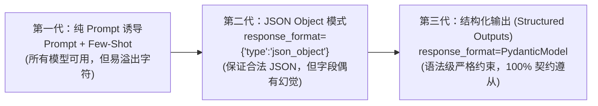

# 结构化输出架构演进与少样本 (Few-Shot) 范式

在真实的企业级业务流水线中，大模型很少独立向用户输出长篇大论，更多时候它是**数据抽取与决策中枢**。我们要求它返回能够被下游系统直接反序列化为数据库实体或 API 请求的结构化数据（如 JSON）。

本章将梳理结构化数据抽取的技术演进史，并揭示生产环境中的最佳实现范式。

---

## 1. 结构化输出技术的三代演进



### 第一代：纯 Prompt 约束 + Few-Shot（通用性最强）
通过在 Prompt 中定义严格的 Schema，并提供 2~3 个完整的输入输出样本（Few-Shot）。
- **优势**：兼容所有开源与商业大模型（包括本地部署的 llama.cpp、Ollama、早期模型）。
- **缺陷**：偶尔在开头包含 ```json 或输出额外的说明文字，需要编写脆弱的正则表达式进行后处理清理。

### 第二代：JSON Object 模式 (`type: "json_object"`)
向 API 传递参数 `response_format={"type": "json_object"}`。
- **优势**：保证大模型输出的一定是严格合法的 JSON 格式，绝不会包含外层的自然语言。
- **缺陷**：大模型只承诺“这是个合法的 JSON”，但**不保证这个 JSON 包含哪些字段**，模型依然可能漏掉关键 Key 或给 Key 起错名字。

### 第三代：基于形式文法的结构化输出 (Structured Outputs)
现代 OpenAI SDK 提供了 `client.beta.chat.completions.parse(..., response_format=MyPydanticModel)`。
- **优势**：在模型采样解码层（Logits 预测）施加有限状态机约束（CFG / Context-Free Grammar），**100% 保证字段名、字段类型、嵌套结构与 Pydantic 类完全吻合**，彻底根除字段幻觉。

---

## 2. Few-Shot (少样本提示) 的架构师级选样法则

在很多复杂的信息抽取场景中（例如从冗长杂乱的客服聊天记录中提取维权诉求），仅给出 Pydantic 字段往往不够，模型需要理解深层的业务标准。
这时，**高质量的 Few-Shot 样本是不可替代的秘密武器**。

优秀的 Few-Shot 样本必须遵循 **3 个工程原则**：

1. **边界与反例原则 (Edge Cases & Negatives)**：
   不要只给标准的满分正例！至少包含一个“信息缺失”、“客户顾左右而言他”的反例，告诉模型此时应该填 `null` 或空列表，而不是胡乱脑补。
2. **格式与 Schema 严格对齐**：
   Few-Shot 中的 Key 名称、大小写、数据类型必须与你的预期 1:1 严格对齐，大模型有极强的模式拟合能力，样本中任何一个空格的瑕疵都会被它无限放大。
3. **样本多样性 (Diversity over Quantity)**：
   通常 2~3 个覆盖不同情况的样本（简单正例、复杂长文本正例、缺失信息的反例）效果远胜于 10 个雷同的简单样本。过多样本还会白白浪费你的 Prompt Token 预算。

---

👉 **接下来，请打开 [`lesson2_data_extractor.py`](file:///Users/pangyao/Desktop/util/llm/code/openai-python/prompt_engineering_course/02_intermediate_structured_output/lesson2_data_extractor.py)，我们将同时实战第一代 Few-Shot 提取与第三代 Pydantic 严格提取，观察它们在应对不完整信息时的表现差异！**
