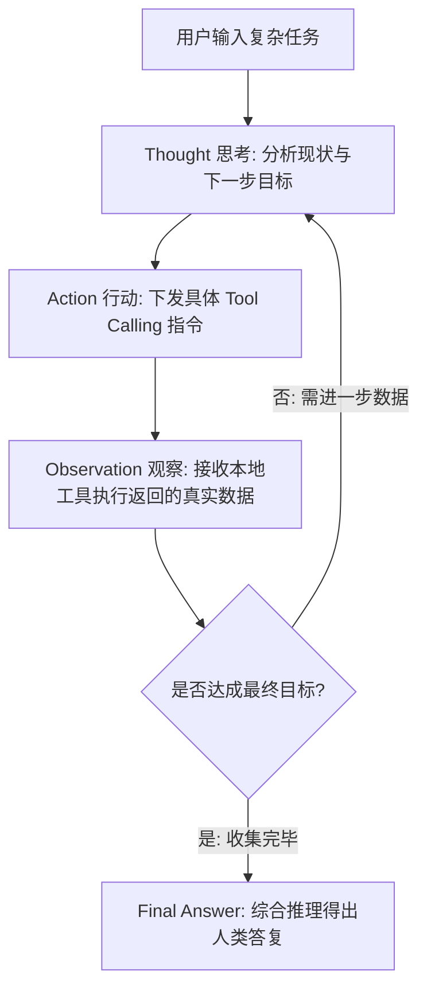

# 复杂推理与 Agent 范式：CoT 思维链到 ReAct 循环

在单轮问答中，大模型只需要一次性输出答案。但在面对复杂多步骤的任务时（例如：“分析这三家公司的财报，找出利润率最高的一家，并向其发送合作意向邮件”），让大模型“立刻给出行动”常常会导致翻车：模型会选错工具、传错参数，或者遗漏中间步骤。

解决这个问题的关键，就是**通过 Prompt Engineering 改变大模型的思考方式**。

---

## 1. 思维链 (Chain-of-Thought, CoT) 的底层心理学机制

自回归大模型（Transformer）在生成每一个 Token 时，能看到的“上下文”仅限于前面已经生成的所有 Token。
如果你直接问它一个复杂问题并要求立刻给出答案，它只能在极短的几个 Token 预测里做盲目赌博。

> [!TIP]
> **CoT 的核心机理**：
> 强迫模型把**“草稿纸上的推导过程”**用文字写出来。写出的思考过程会成为后续 Token 预测的新上下文（Working Memory / 工作记忆），使得最终决策的准确率呈现数量级跃升！

- **Zero-Shot CoT**：经典启发词 `"Let's think step by step"`（让我们一步一步地思考）。
- **Few-Shot CoT**：在少样本示例中，手写展现出人类逐步推导、排除干扰项的思考轨迹。

---

## 2. ReAct 范式：推理与行动的交响曲

ReAct 论文由普林斯顿大学与谷歌团队提出，其核心公式是：
$$\text{ReAct} = \text{Reasoning} \text{ (推理)} + \text{Acting} \text{ (行动)}$$

单纯的 Reasoning（仅思考）无法获取外界最新动态；单纯的 Acting（仅调工具）缺乏全局规划能力。ReAct 通过在 Prompt 中规定交替输出格式，将两者完美结合：



### 生产级 ReAct System Prompt 规范

```xml
<system_instruction>
  <role>你是一个高度自律的复合任务执行智能体。</role>
  
  <execution_protocol>
    在调用任何外部工具之前，你必须在回答中首先输出思考标签 <thought>...</thought>。
    思考内容必须涵盖以下三点：
    1. 【目标澄清】：当前用户的核心诉求是什么？
    2. 【现状评估】：目前已掌握了哪些信息，还缺少什么信息？
    3. 【行动计划】：为何选择当前工具，预期的参数是什么？
    
    严禁不经思考直接下发调用指令！
  </execution_protocol>
</system_instruction>
```

> [!IMPORTANT]
> **为什么必须在 Tool Calling 前强制输出 `<thought>`？**
> 实验表明，强制大模型在下达 JSON 工具参数之前先吐出 50~100 个 Token 的思考分析，能够**将参数传错率降低 65% 以上**，并大幅减少死锁循环（同一工具反复调用）。

---

👉 **接下来，请打开 [`lesson3_agent_reasoning.py`](file:///Users/pangyao/Desktop/util/llm/code/openai-python/prompt_engineering_course/03_advanced_reasoning_agent/lesson3_agent_reasoning.py)，我们将通过代码演示如何通过思维链 Prompt 控制多步骤工具调用的准确率！**
