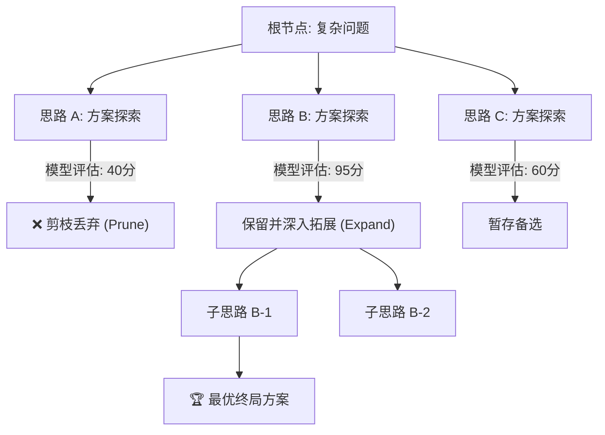
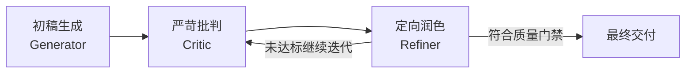

# 高阶思维范式：自洽性、思维树 (ToT) 与自我反思 (Self-Refine)

普通的 CoT 思维链是一条**单向、线性的思考路径**。
一旦模型在第一步推导中出现微小偏差（一步错），后面的所有推导都会沿着错误的方向雪崩式发展（步步错）。

作为一名企业级 Prompt 架构师，你需要掌握超越线性思维的三大前沿思维范式：**自洽性 (Self-Consistency)**、**思维树 (Tree of Thoughts, ToT)** 与 **自我反思迭代 (Self-Refine)**。

---

## 1. 自洽性采样 (Self-Consistency)：多数投票表决

在数学推导、逻辑谜题或事实裁决中，单次采样（temperature=0）往往容易卡在局部的错误概率峰值上。

- **原理**：将 Temperature 调高至 `0.7`，并发向大模型发起 5~10 次相同的 CoT 提问（生成 5~10 条独立的推理路径），最后统计答案中出现频次最高的那一个。
- **价值**：大模型往往“条条大路通罗马”，虽然中间推理步骤各有不同，但正确答案出现的频次显著高于随机错误答案。这是提升推理准确率最简单粗暴且极为有效的工程手段。

---

## 2. 思维树 (Tree of Thoughts, ToT)：探索、评估与回溯

Tree of Thoughts (ToT) 由普林斯顿大学与 DeepMind 联合提出，它将语言模型的生成过程转化为在**树形解空间中的搜索算法**（类似围棋 AI AlphaGo 的蒙特卡洛树搜索思想）：

ToT 的三个核心 Prompt 角色：
1. **生成器 (Thought Generator)**：针对当前状态，头脑风暴生成 3 种完全不同的下一步思路。
2. **评估器 (Thought Evaluator)**：对每种思路进行 0~100 分打分，指出潜在风险。
3. **决策器 (Search Controller)**：保留高分分支，主动剪枝（Prune）低分分支，如果陷入死胡同则执行回溯（Backtracking）。

---

## 3. 自我反思与批判改进 (Self-Refine / Self-Correction)

在很多生成任务中（如撰写法律合同条款、优化代码、编写高质量文案），要求模型“一步到位写出满分作品”非常困难。但如果给它一份草稿，让它**换位思考当评审员找茬**，模型能轻易挑出大量漏洞！

**Self-Refine 闭环三部曲**：

1. **Generation (生成)**：根据基础指令快速产出初版草稿。
2. **Critique (批判)**：向模型输入专门设计的**批判量规（Rubric）**，让其站在刁钻的视角挑刺（比如：“这篇文案是否存在虚假宣传？语句是否太啰嗦？格式是否符合规范？”）。
3. **Refinement (重构)**：将“原草稿 + 挑刺意见”作为输入，让模型针对性重写。

实测表明，经过仅仅 1 轮 Self-Refine，输出内容的专业度与合规率即可提升 **40% 以上**。

---

👉 **接下来，请打开 [`lesson4_thinking_patterns.py`](file:///Users/pangyao/Desktop/util/llm/code/openai-python/prompt_engineering_course/04_advanced_thinking_patterns/lesson4_thinking_patterns.py)，我们将编写一个可运行的 Self-Refine 自动化流水线，亲眼见证模型“自我纠错”的惊艳蜕变！**
