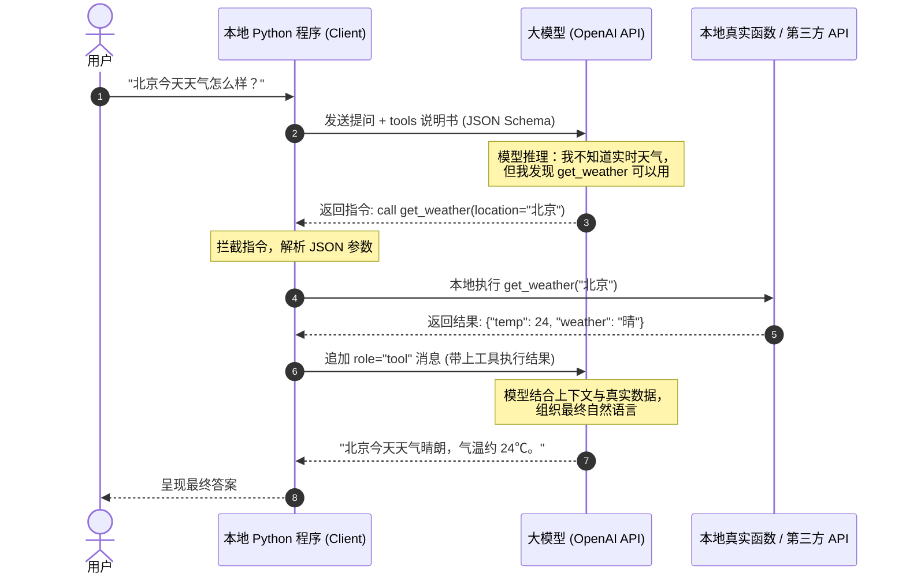
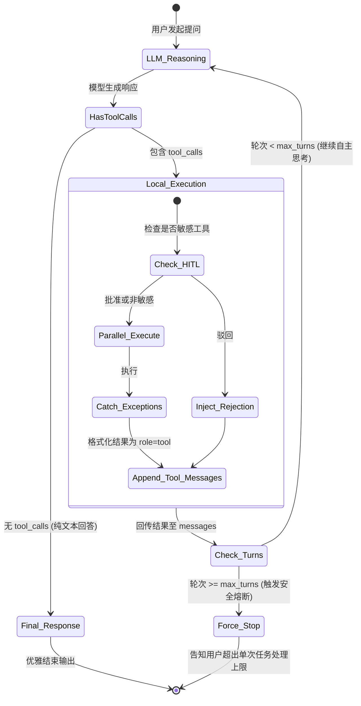

# OpenAI SDK Tool Calling 工业级大师课 (Masterclass)

本教程是一份面向生产级 AI 应用与智能体（Agent）开发的终极指南。我们将从底层交互协议出发，跨越从基础单轮调用到动态注册表、高并发执行、错误自愈、流式切片处理，直至构建一个具备**自主循环 (While-Loop)**、**严格模式 (Strict Mode)**、**人机协同 (Human-in-the-Loop)** 与 **上下文修剪** 的完整工业级 Agent。

配套实战源码已同步放置在 [`examples-demo/`](file:///Users/pangyao/Desktop/util/llm/code/openai-python/examples-demo) 目录下，每一个步骤均有独立可运行的 Python 脚本。

---

## 🗺 知识全景图与学习路线

```mermaid
graph TD
    classDef foundation fill:#E3F2FD,stroke:#1565C0,stroke-width:2px;
    classDef control fill:#E8F5E9,stroke:#2E7D32,stroke-width:2px;
    classDef robust fill:#FFF3E0,stroke:#E65100,stroke-width:2px;
    classDef agent fill:#F3E5F5,stroke:#7B1FA2,stroke-width:2px;

    subgraph 第一篇：基础认知与机制篇
        S1["Step 1: Pydantic 工具定义"]:::foundation --> S2["Step 2: Strict 严格模式"]:::foundation
        S2 --> S3["Step 3: 接发球完整闭环"]:::foundation
    end

    subgraph 第二篇：精准控制与架构解耦篇
        S3 --> S4["Step 4: tool_choice 行为调控"]:::control
        S4 --> S5["Step 5: 装饰器工具注册表"]:::control
        S5 --> S6["Step 6: asyncio 异步并发"]:::control
    end

    subgraph 第三篇：鲁棒性与极致体验篇
        S6 --> S7["Step 7: 异常反哺与模型自愈"]:::robust
        S7 --> S8["Step 8: 流式分片积攒与推流"]:::robust
        S8 --> S9["Step 9: Human-in-the-Loop 审批"]:::robust
    end

    subgraph 第四篇：终极自主智能体篇
        S9 --> S10["Step 10: 自主 Agent 状态机循环<br>(While-Loop + 上下文修剪 + 熔断保护)"]:::agent
    end
```

---

## 🌟 第一篇：基础认知与机制篇 (Foundations)

### 💡 核心底层真相：工具调用是一场“接发球游戏”

很多初学者对 Tool Calling（函数调用）有一个极大的误解：认为“大模型连接了互联网，能在 OpenAI 服务器上运行我的本地 Python 代码”。

> [!IMPORTANT]
> **大模型绝对不会在云端运行你的代码！**
> 大模型本质是一个纯文本/Token 预测概率模型。所谓的“调用工具”，是大模型根据你提供的函数说明书，在回答中输出了一段**结构化的 JSON 调用指令**，然后由**你在本地客户端执行代码**，再把执行结果**当作新消息喂回给大模型**。



---

### Step 1：现代且优雅的工具定义 (`pydantic_function_tool`)

向大模型描述工具时，标准的 OpenAI 格式是一段非常冗长、易出错的 JSON Schema。
现代官方 SDK 提供了 `pydantic_function_tool` 工具，允许你直接使用 Python 标准的 `Pydantic` 类来定义参数！

```python
# 对应实战源码: examples-demo/lesson1_define_tool.py
from pydantic import BaseModel, Field
from openai import pydantic_function_tool

# 1. 像写业务数据模型一样定义参数
class WeatherParams(BaseModel):
    # Field(description=...) 会直接注入到 Schema 中供大模型理解语义
    location: str = Field(description="城市名称，例如：北京、上海、东京")
    unit: str = Field(default="celsius", description="温度单位：celsius (摄氏度) 或 fahrenheit (华氏度)")

# 2. 转换成大模型认识的 Tool Schema
my_tools = [
    pydantic_function_tool(
        model=WeatherParams,
        name="get_current_weather",
        description="当用户询问某个城市的当前天气状况时调用此工具。"
    )
]

print("生成的标准 Tool JSON Schema:")
print(my_tools)
```

---

### Step 2：消除幻觉的杀手锏 —— 严格模式 (`strict=True`)

在企业级生产环境中，普通 Tool Calling 最让人头疼的问题之一是：模型可能会**随机漏传必填参数**，或者**凭空捏造 Schema 里没有的字段**。

OpenAI 推出的 **Structured Outputs / Strict Tools** 功能通过形式化语法约束（Grammar-based Constrained Decoding），在采样层强制模型输出 100% 合规的 JSON！

```python
# 开启 Strict 模式
strict_tool = pydantic_function_tool(
    model=WeatherParams,
    name="get_current_weather",
    description="获取指定城市的实时天气",
    # 核心开关：强制 100% 遵守 JSON Schema 契约
    # 所有字段必须标注类型，所有参数都将被置为 required（可选字段使用 Optional 或 Union[T, None]）
)
# SDK 底层会自动处理 additionalProperties: False 等约束
```

> [!TIP]
> **Strict 模式的最佳实践**：
> 1. 生产环境下定义工具，凡是关键业务接口，强烈推荐使用支持 `strict=True` 的结构化工具。
> 2. Pydantic 模型中的字段不要遗漏类型注解，默认值如果为可选，明确声明为 `Optional[str] = None`。

---

### Step 3：接发球完整闭环 (拦截指令与结果回传)

执行工具调用时，有三个不可打破的规范：
1. **必须保留上下文**：大模型下发的带有 `tool_calls` 的 `assistant` 消息必须先被 `append` 到 `messages` 里。
2. **必须指明身份**：工具返回的结果，其角色必须是 `role: "tool"`。
3. **必须配对 ID**：工具消息必须包含 `tool_call_id: tool_call.id`，大模型靠这个 ID 将结果与指令严格绑定。

```python
# 对应实战源码: examples-demo/lesson3_full_loop.py (已清理多层 if 嵌套)
import json
import os
from openai import OpenAI
from pydantic import BaseModel, Field
from openai import pydantic_function_tool

client = OpenAI(
    api_key=os.environ.get("OPENAI_API_KEY", "your-api-key"),
    base_url=os.environ.get("OPENAI_BASE_URL", None) # 自动兼容智谱/DeepSeek等端点
)

def query_weather(city: str) -> str:
    """本地真实业务逻辑"""
    return json.dumps({"city": city, "temp": "23°C", "condition": "多云有阵雨"}, ensure_ascii=False)

class WeatherArgs(BaseModel):
    city: str = Field(description="城市名称")

tools = [pydantic_function_tool(model=WeatherArgs, name="query_weather", description="查询天气")]
messages = [{"role": "user", "content": "帮我看看深圳今天的天气。"}]

# 第一轮对话：大模型产生 tool_calls 指令
response = client.chat.completions.create(
    model=os.environ.get("OPENAI_MODEL_NAME", "gpt-4o-mini"),
    messages=messages,
    tools=tools
)
assistant_msg = response.choices[0].message
messages.append(assistant_msg) # ⚠️ 关键：必须塞入历史记录

if assistant_msg.tool_calls:
    for tc in assistant_msg.tool_calls:
        # 解析模型传过来的 JSON 参数
        args = json.loads(tc.function.arguments)
        if tc.function.name == "query_weather":
            exec_result = query_weather(args["city"])
            
            # 追加工具执行结果
            messages.append({
                "role": "tool",
                "tool_call_id": tc.id, # ⚠️ 必须与指令中的 ID 严格一致
                "content": exec_result
            })

    # 第二轮对话：模型阅读工具结果，生成最终人类语言
    final_res = client.chat.completions.create(
        model=os.environ.get("OPENAI_MODEL_NAME", "gpt-4o-mini"),
        messages=messages
    )
    print("🤖 最终回答:", final_res.choices[0].message.content)
```

---

## 🛠 第二篇：精准控制与架构解耦篇 (Control & Patterns)

### Step 4：精准操控大模型决策 (`tool_choice`)

有时大模型倾向于用通用知识直接回答而不去调用外部系统，或者在客服特定流程中，你必须**强行要求大模型调用某个特定工具**。

通过 `tool_choice` 参数可以精确约束其行为：

| `tool_choice` 取值 | 行为解释 | 典型适用场景 |
| :--- | :--- | :--- |
| `"auto"` (默认) | 模型自主权衡：自己决定直接回答还是调用 0 个、1 个或多个工具 | 通用问答与开放式 Agent |
| `"required"` | 模型**必须**调用至少一个工具，但具体挑哪个工具由它自主决定 | 问答明确依赖外部数据（如智能报表、数据库问答） |
| `{"type": "function", "function": {"name": "foo"}}` | 模型**绝对必须**调用 `foo` 工具，禁止调用其他工具，禁止废话 | 表单抽取、强制路由、结构化数据采集 |
| `"none"` | 禁用工具调用，哪怕传了 `tools` 列表模型也不会调用 | 上下文存在工具定义但当前回合希望纯聊天 |

```python
# 对应实战源码: examples-demo/lesson4_tool_choice.py
response = client.chat.completions.create(
    model="gpt-4o-mini",
    messages=[{"role": "user", "content": "你好，我想写一首诗。"}],
    tools=tools,
    # 强制模型调用天气函数，模型哪怕面对写诗的要求，也会乖乖生成工具指令
    tool_choice={"type": "function", "function": {"name": "query_weather"}},
    # 还可以显式关闭并行工具调用（强制每次只调一个）：
    parallel_tool_calls=False
)
```

---

### Step 5：工业级工具注册表 (ToolRegistry) —— 告别 `if/else` 面条代码

如果在业务中你有 30 个工具，写 30 个 `if tc.function.name == "xxx": ... elif ...` 会让代码迅速腐化。
在 Python 架构中，最优雅的设计模式是**装饰器模式 (Decorator Pattern)**：在定义函数的同时完成 Schema 注册与执行路由绑定。

```python
# 对应实战源码: examples-demo/lesson5_registry.py
import json
from typing import Callable, Dict, Any
from pydantic import BaseModel, Field
from openai import pydantic_function_tool

class ToolRegistry:
    def __init__(self):
        self._registry: Dict[str, Callable] = {}
        self.openai_tools = []

    def register(self, model: type[BaseModel], name: str, description: str):
        """装饰器：一步完成工具函数注册与 Schema 生成"""
        def decorator(func: Callable):
            self._registry[name] = func
            self.openai_tools.append(
                pydantic_function_tool(model=model, name=name, description=description)
            )
            return func
        return decorator

    def execute(self, tool_name: str, arguments_json: str) -> str:
        """动态路由与派发"""
        if tool_name not in self._registry:
            return json.dumps({"error": f"Tool '{tool_name}' not found."})
        func = self._registry[tool_name]
        try:
            kwargs = json.loads(arguments_json)
            result = func(**kwargs)
            return json.dumps(result, ensure_ascii=False) if not isinstance(result, str) else result
        except Exception as e:
            return json.dumps({"error": f"Failed to execute {tool_name}: {str(e)}"})

# ======== 业务代码瞬间变得极简 ========
registry = ToolRegistry()

class OrderArgs(BaseModel):
    order_id: str = Field(description="订单号")

@registry.register(model=OrderArgs, name="query_order", description="查询订单物流状态")
def query_order(order_id: str):
    return {"order_id": order_id, "status": "已发货", "location": "杭州分拨中心"}

# 请求大模型时传入: tools=registry.openai_tools
# 拦截到调用指令时只需单行派发: result = registry.execute(tc.function.name, tc.function.arguments)
```

---

### Step 6：异步高性能并发 (`asyncio.gather`)

当用户输入：“请分别帮我查一下北京、上海、广州、成都、杭州的天气”，现代大模型（如 GPT-4o 系列）会并发返回 5 个 `tool_calls`。
如果你用 `for` 循环同步去调 5 次外部 HTTP API，总耗时将是所有请求的叠加。

利用 Python 的 `asyncio`，可以把串行执行变成并行发射：

```python
# 对应实战源码: examples-demo/lesson7_parallel.py
import asyncio
import json

async def async_execute_tool(registry, tool_call):
    """将每个工具调用的执行包装为一个异步协程"""
    # 如果函数本身是同步阻塞的，可以使用 asyncio.to_thread 放入线程池运行
    return await asyncio.to_thread(
        registry.execute, 
        tool_call.function.name, 
        tool_call.function.arguments
    )

async def handle_parallel_tool_calls(tool_calls, registry):
    # 1. 创建并发协程任务列表
    tasks = [async_execute_tool(registry, tc) for tc in tool_calls]
    
    # 2. 一网打尽：总耗时取决于最慢的那一个网络接口
    results = await asyncio.gather(*tasks)
    
    # 3. 按顺序组织回传消息
    tool_messages = []
    for tc, res in zip(tool_calls, results):
        tool_messages.append({
            "role": "tool",
            "tool_call_id": tc.id,
            "content": res
        })
    return tool_messages
```

---

## 🛡 第三篇：企业级鲁棒性与交互篇 (Robustness & Experience)

### Step 7：大模型“自愈”容错机制 (Self-Healing)

在生产环境中，外部 API 可能偶发超时、网络波动，或者大模型偶尔生成了非法的参数。普通程序一旦抛出未处理异常，整个进程就会崩掉或向用户抛出 `500 Server Error`。

> [!TIP]
> **大模型的自愈哲学**：
> 大模型具有极强的错误诊断与语义纠错能力！
> **绝对不要让程序崩溃，而是把错误信息（Error Diagnostic String）作为 `role: "tool"` 的 `content` 喂回给大模型。**
> 模型读取报错信息后，通常能自动调整参数重新发起调用，或者以极其体面的口吻向用户道歉并给出替代方案。

```python
# 对应实战源码: examples-demo/lesson6_self_healing.py
def safe_tool_executor(func: Callable, arguments_json: str) -> str:
    try:
        kwargs = json.loads(arguments_json)
        return func(**kwargs)
    except json.JSONDecodeError as e:
        # 模型输出的 JSON 语法破损
        return f"[System Error] Arguments are not valid JSON: {str(e)}. Please retry with strictly valid JSON format."
    except KeyError as e:
        # 遗漏了关键字段
        return f"[System Error] Missing required field {str(e)}. Please provide all required arguments."
    except TimeoutError:
        # 外部依赖接口超时
        return "[System Error] The external weather API service timed out. Please inform the user gracefully without hallucinating data."
    except Exception as e:
        return f"[System Error] Execution failed with error: {str(e)}"
```

---

### Step 8：流式输出 (Streaming) 中的工具拦截与分片拼接

现代 Web 界面要求逐字打出回复（Streaming 流式体验）。但是，当开启 `stream=True` 时，大模型并不是一次性把完整的 `tool_calls` JSON 扔过来，而是**将函数名和 JSON 字符串切碎成无数个微小的碎片（Chunk）陆续吐出**！

你必须在前端无感知的情况下，在后台维护一个缓冲区（Buffer），将切碎的 JSON 碎片拼合成完整的字符串，再触发工具执行。

```mermaid
graph TD
    A[Chunk 1: id=call_01, name=get_weather, args=''] --> B[内存 Buffer 积攒]
    C["Chunk 2: args='{\"location\": '"] --> B
    D["Chunk 3: args='\"Beijing\"}'"] --> B
    B --> E{流结束: 检查 Buffer}
    E --> F[完整参数拼装完成: json.loads 提取]
    F --> G[本地执行工具]
    G --> H[将结果追加至 messages]
    H --> I[发起第二轮流式调用: 逐字向客户端吐出最终文本]
```

```python
# 对应实战源码: examples-demo/lesson8_streaming.py
from openai import OpenAI
client = OpenAI()

response = client.chat.completions.create(
    model="gpt-4o-mini",
    messages=[{"role": "user", "content": "北京现在的天气如何？"}],
    tools=tools,
    stream=True
)

tool_calls_buffer = {}

for chunk in response:
    delta = chunk.choices[0].delta
    
    # 1. 如果大模型生成的是纯文字回答，直接流式推给前端
    if delta.content:
        print(delta.content, end="", flush=True)
        
    # 2. 如果检测到工具碎片，进行拼接
    if delta.tool_calls:
        for tc_chunk in delta.tool_calls:
            idx = tc_chunk.index
            if idx not in tool_calls_buffer:
                tool_calls_buffer[idx] = {
                    "id": tc_chunk.id or "",
                    "name": tc_chunk.function.name or "",
                    "arguments": ""
                }
            if tc_chunk.id:
                tool_calls_buffer[idx]["id"] = tc_chunk.id
            if tc_chunk.function.name:
                tool_calls_buffer[idx]["name"] = tc_chunk.function.name
            if tc_chunk.function.arguments:
                tool_calls_buffer[idx]["arguments"] += tc_chunk.function.arguments

# 如果积攒到了工具调用，在后台无缝执行并开启第二轮流式响应
if tool_calls_buffer:
    print("\n[后台静默拦截并执行工具]...")
    # 组装 assistant 消息并执行工具后追加 tool 消息
    # 紧接着发起第二次 stream=True 请求，让最终总结以打字机模式呈现给用户！
```

---

### Step 9：人机协同审批机制 (Human-in-the-Loop, HITL)

在企业级智能体中，让 AI 自主查询数据是安全的，但如果工具涉及到**高危敏感操作**（例如：扣款转账、清空数据库、发送对外公文、修改系统配置），绝对不能任由模型自主静默执行！

我们需要引入 **人机协同确认机制**：拦截特定高危操作，挂起当前执行流，向人类展示拟执行的参数并获取明确授权。

```python
# 对应实战源码: examples-demo/lesson9_human_in_the_loop.py
class SensitiveToolManager:
    SENSITIVE_TOOLS = {"transfer_money", "delete_user", "send_email"}

    @classmethod
    def check_and_execute(cls, tool_name: str, args: dict, registry) -> str:
        if tool_name in cls.SENSITIVE_TOOLS:
            print(f"\n🚨 [高危安全拦截] 模型请求执行敏感操作: {tool_name}")
            print(f"📋 拟执行参数: {json.dumps(args, ensure_ascii=False, indent=2)}")
            confirm = input("⚠️ 是否批准执行该操作？(输入 Y 批准，输入 N 驳回): ").strip().upper()
            
            if confirm != "Y":
                # 人类驳回操作，告知大模型并给出安全理由
                return json.dumps({
                    "status": "rejected",
                    "reason": "该操作已被人类管理员明确驳回，请停止尝试并告知用户操作已取消。"
                }, ensure_ascii=False)

        # 正常放行执行
        return registry.execute(tool_name, json.dumps(args))
```

---

## 🚀 第四篇：终极自主智能体篇 (Autonomous Agent Architecture)

### Step 10：自主多轮驱动循环 (Agent While-Loop 与状态机)

在之前的初级代码中，我们常常看到两层嵌套的 `if assistant_msg.tool_calls`。但如果一个复杂的任务需要：
1. 先调工具 `search_web` 搜索最新资讯；
2. 发现需要某个专业指标，紧接着调用 `calculate_metric` 进行数学计算；
3. 计算完毕后调用 `save_to_notion` 记录结果；
4. 最后再向用户汇报。

这需要几轮？事先根本无法预知！
**真正的 Agent 必须是一个自主循环状态机（While Loop）**，同时配备：
- **最大轮次熔断保护 (`max_turns`)**：防止模型死锁陷入无限调用的死循环，烧毁 Token。
- **上下文滑动窗口修剪 (Context Pruning)**：避免多轮工具吐出的大体积数据撑爆模型上下文窗口。



#### 完整自主 Agent 引擎核心实现：

```python
# 对应实战源码: examples-demo/lesson10_autonomous_agent.py
import json
import os
from openai import OpenAI

class AutonomousAgent:
    def __init__(self, client: OpenAI, registry, max_turns: int = 6):
        self.client = client
        self.registry = registry
        self.max_turns = max_turns

    def run(self, user_prompt: str, model: str = "gpt-4o-mini"):
        messages = [
            {"role": "system", "content": "你是一个高度自主且专业的 AI 助手，善于合理规划并连续调用工具来解决复杂问题。"},
            {"role": "user", "content": user_prompt}
        ]
        
        turn = 0
        while turn < self.max_turns:
            turn += 1
            print(f"\n🔄 --- [Agent 执行轮次 {turn}/{self.max_turns}] ---")
            
            # 上下文裁剪优化：如果消息过长，保留 system 与最近的对话
            pruned_messages = self._prune_context(messages)
            
            response = self.client.chat.completions.create(
                model=model,
                messages=pruned_messages,
                tools=self.registry.openai_tools
            )
            msg = response.choices[0].message
            messages.append(msg)
            
            # 如果没有工具调用，说明 Agent 已经得出最终结论，打破循环！
            if not msg.tool_calls:
                print("✅ Agent 自主完成任务，输出最终回复：")
                return msg.content
                
            # 并发执行拦截到的所有工具
            for tc in msg.tool_calls:
                func_name = tc.function.name
                func_args = tc.function.arguments
                print(f"🔧 Agent 决定调用工具: {func_name} (参数: {func_args})")
                
                # 安全执行与自愈保护
                result = self.registry.execute(func_name, func_args)
                
                messages.append({
                    "role": "tool",
                    "tool_call_id": tc.id,
                    "content": result
                })
        
        return "⚠️ [安全熔断] Agent 达到了最大轮次限制，已强制终止以防死循环。"

    def _prune_context(self, messages: list, max_messages: int = 20) -> list:
        """保持 System 提示词不变，仅裁剪过早的工具中间细节"""
        if len(messages) <= max_messages:
            return messages
        system_msg = [m for m in messages if m.get("role") == "system"]
        recent_msgs = messages[-(max_messages - len(system_msg)):]
        return system_msg + recent_msgs
```

---

## 🧭 第五篇：一线工程踩坑与最佳实践 (Gotchas & Production Checklist)

在真实工业落地中，请牢记以下“血泪经验”：

### 1. 工具描述语义重叠与模型“选择困难症”
- **现象**：当定义了 `search_local_docs` 与 `search_knowledge_base` 时，大模型常常纠结不知道调哪个，甚至随意乱选。
- **最佳实践**：**正交设计原则**。在 `Field(description=...)` 中明确写明：*“本工具仅用于 XX 场景。如果是 YY 场景，请勿调用此工具，而应调用 ZZ 工具。”*

### 2. 避免在工具中返回巨大 JSON 数据
- **现象**：一次数据库或检索工具调用返回了 200 条数据，几十万 Token，直接将上下文撑爆并导致 API 报错 `context_length_exceeded`。
- **最佳实践**：
  - 本地做数据切片与摘要：只给模型返回最相关的 Top 3 条或关键字段。
  - **指针/句柄模式**：将大结果存入本地缓存/临时文件，只给模型返回类似 `{"dataset_id": "temp_8912", "summary": "共找到 500 条数据", "preview": [...]}`，后续分析工具按 `dataset_id` 消费。

### 3. 模型陷入重复调用的死循环 (Breakout 机制)
- **现象**：模型查天气失败 -> 报错 -> 再次用相同参数查天气 -> 再次报错。
- **最佳实践**：在 Agent Loop 中记录工具调用的历史签名哈希。如果发现同一个工具带着完全相同的参数在 2 轮内连续报错，向模型注入强制性系统提示：*“该参数已被验证无效，请立刻停止调用该工具，直接向用户说明失败原因。”*

### 4. 生产环境安全与多模型端点兼容规范
- **密钥安全**：永远不要在代码中硬编码任何真实 API 密钥。使用 `os.environ.get("OPENAI_API_KEY")`。
- **端点透明兼容**：支持通过 `os.environ.get("OPENAI_BASE_URL")` 切换至国内主流大模型（如智谱 GLM、DeepSeek、阿里云百炼等兼容端点），只需保证模型支持标准的 Function Calling 协议即可无缝运行。

---

## 💻 配套源码快速运行指南

所有完整源码位于 [`examples-demo/`](file:///Users/pangyao/Desktop/util/llm/code/openai-python/examples-demo) 目录，按章节循序渐进：

```bash
# 设置环境变量（以兼容端点为例，官方 OpenAI 则无需设置 base_url）
export OPENAI_API_KEY="your-api-key"
export OPENAI_BASE_URL="https://api.openai.com/v1" # 或智谱/DeepSeek等端点
export OPENAI_MODEL_NAME="gpt-4o-mini"

# 运行各章节独立实战脚本
python examples-demo/lesson1_define_tool.py          # Step 1: Pydantic 与 Strict Schema 对比
python examples-demo/lesson2_trigger_tool.py         # Step 2: 拦截与检查 tool_calls 指令
python examples-demo/lesson3_full_loop.py            # Step 3: 单轮接发球闭环
python examples-demo/lesson4_tool_choice.py          # Step 4: tool_choice 精准行为控制
python examples-demo/lesson5_registry.py             # Step 5: 装饰器工具注册表
python examples-demo/lesson6_self_healing.py          # Step 6: 错误诊断与自愈
python examples-demo/lesson7_parallel.py              # Step 7: asyncio 并发提速
python examples-demo/lesson8_streaming.py             # Step 8: 流式分片积攒与二次推流
python examples-demo/lesson9_human_in_the_loop.py    # Step 9: 高危操作人机协同审批
python examples-demo/lesson10_autonomous_agent.py    # Step 10: 终极自主 Agent 引擎
```
